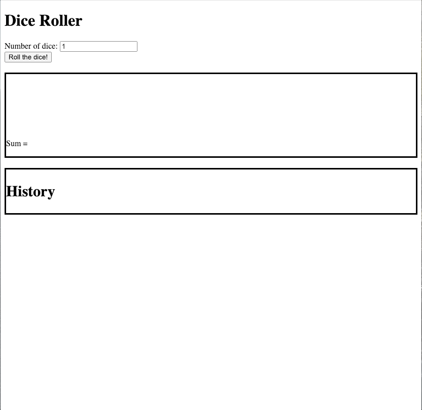

[](https://pursuit.org)

# Pursuit-Core-Module-Two-Mid-module-Assessment

## Getting Started 
* Fork this repo
* Clone the forked repository
* `cd` to the directory where you cloned it
* `npm install` to install dependencies
* `npm test` to open the cypress testing window

> *Note*: Remember to `git add`, `git commit` and `git push` regularly

## Submission Guidelines
  * When finished, commit and push your work.
  * Make a pull request on github.
  * Submit the link to your pull request on Canvas. 


## Assessment Details

Build a website with the following user stories:

- As a user I can select how many dice I want to roll
- As a user, I can click a button to roll that many dice
- As a user, I can view the dice roll as well as its sum
- As a user, I can view the history of all of my previous rolls and their sums

## Testing notes:

- Your history items should be `li` elements.
- Clicking the roll button the first time should not add anything to the history
- Subsequent clicks to the rolls button should add the previous roll to the history
- The only `li` elements should be your history dice rolls
- You should have exactly one `input` element where the number of dice can be entered
- You should have exactly one `button` element that the user can click on to roll the dice
- The die result from rolling should be stored in an element with the id "dice-para"
- The sum from rolling should be stored in an element with the id "sum-para"
- Use the follow HTML entity values for dice:

```
&#9856 = ⚀
&#9857 = ⚁
&#9858 = ⚂
&#9859 = ⚃
&#9860 = ⚄
&#9861 = ⚅
```

